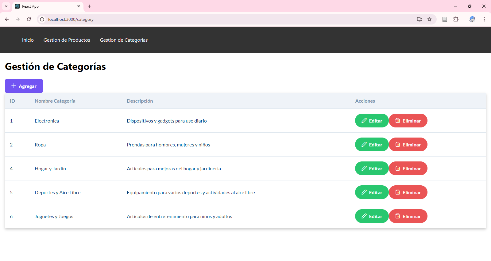

# Gestión de Productos y Categorías

Este proyecto es una aplicación web para la gestión de productos y categorías, construida con Node.js, Express, MySQL para el backend y React para el frontend. 

## Tecnologías Utilizadas

- **Backend**: Node.js, Express, MySQL
- **Frontend**: React, PrimeReact
- **Herramientas de Desarrollo**: Axios, Nodemon

## Descripción

Esta aplicación permite realizar las siguientes operaciones:
- **Productos**: Crear, leer, actualizar y eliminar productos.
- **Categorías**: Crear, leer, actualizar y eliminar categorías.


## Capturas

### Categorias


### Productos


## Instalación


```bash
git clone https://github.com/sebgh0/CRUD-Productos.git
```

```bash

```